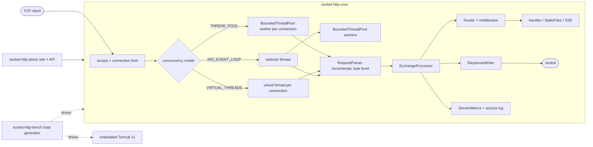

# socket-http

An HTTP/1.1 server written directly on `java.nio` sockets with zero runtime dependencies (JDK only, no `com.sun.net.httpserver`), a small routing API on top of it, and a benchmark harness that compares it with embedded Tomcat. The point is protocol correctness: an incremental byte-level request parser, chunked transfer coding in both directions, pipelining, range requests, request-smuggling defences with RFC 9112 citations, and three interchangeable concurrency models (a hand-written thread pool, virtual threads, and a selector event loop).

[](https://github.com/mgeladzerezo/socket-http/actions/workflows/ci.yml)

## Status of verification (read this first)

- The core test suite (parser, thread pool, server conformance, timeouts, shutdown, overload, concurrency, static files, path traversal, router, middleware) was **run and passed** earlier in the project: 579 tests, 0 failures, 1 skipped (a symlink test that needs a privilege this Windows account lacks).
- The tests added later (`HistogramTest`, `ObservabilityTest`, `DemoAppTest`, `LoadGeneratorTest`) were run once and passed when written. Everything written after that point (the `--healthcheck` option of the demo, `Dockerfile`, `docker-compose.yml`, CI workflow, this README) has been **compiled only** (`mvn -DskipTests package`) and never executed.
- The benchmark has **not been run to completion**. The table below is empty on purpose.
- The Docker image and the compose file have not been built or started. The CI workflow has never run.

## Architecture



Modules: `socket-http-core` (the server library, no dependencies), `socket-http-demo` (site and JSON API on port 8203), `socket-http-bench` (load generator and the Tomcat comparison; the only module with a dependency, `tomcat-embed-core`).

## Quick start

```
docker compose up --build
```

Then open <http://localhost:8203/>: a static site served by the server itself, with live metrics pushed over Server-Sent Events, buttons that call the JSON API and show the raw response, and a button that generates traffic so the charts move. Also try:

```
curl -i http://localhost:8203/api/users
curl -i -H "Range: bytes=0-99" http://localhost:8203/css/style.css
curl -N http://localhost:8203/events/metrics
curl http://localhost:8203/metrics?format=prometheus
```

Without Docker: `./mvnw -B -DskipTests package` then `java -jar socket-http-demo/target/socket-http-demo-1.0.0.jar`. `PORT`, `CONCURRENCY_MODEL` (`THREAD_POOL`, `VIRTUAL_THREADS`, `NIO_EVENT_LOOP`) and `SITE_DIR` are read from the environment.

Library use:

```java
HttpServer server = HttpServer.create(ServerConfig.builder().port(8080).build());
server.use(ErrorMapper.json());
server.get("/users/{id}", ctx -> ctx.json(users.find(ctx.pathParamAsLong("id"))));
server.group("/admin", admin -> { admin.use(requireToken); admin.delete("/users/{id}", ctx -> ...); });
server.get("/events", ctx -> ctx.sse(sse -> sse.send("tick", "hello")));
server.get("/*", StaticFiles.serve(Path.of("public")));
server.start();
```

## The life of one request

Following a `GET /api/users` on an idle keep-alive connection, in the virtual-thread model (the other two differ only in step 1 and 2):

1. **accept.** [`BlockingEngine.acceptLoop`](socket-http-core/src/main/java/io/github/mgeladzerezo/sockethttp/server/BlockingEngine.java) takes a semaphore permit (the connection limit) *before* calling `accept()`. At the limit it stops accepting and clients wait in the kernel backlog, which is the backpressure. The accepted channel becomes a `BlockingConnection` run on a virtual thread (or a [`BoundedThreadPool`](socket-http-core/src/main/java/io/github/mgeladzerezo/sockethttp/concurrent/BoundedThreadPool.java) worker).
2. **read.** [`BlockingConnection.serve`](socket-http-core/src/main/java/io/github/mgeladzerezo/sockethttp/server/BlockingConnection.java) reads whatever bytes arrive into a buffer, subject to the absolute deadlines in [`ReadDeadlines`](socket-http-core/src/main/java/io/github/mgeladzerezo/sockethttp/server/ReadDeadlines.java).
3. **parse.** [`RequestParser.feed`](socket-http-core/src/main/java/io/github/mgeladzerezo/sockethttp/parser/RequestParser.java) consumes the bytes as a state machine (request line, headers, then a Content-Length or chunked body) and returns whether a request is complete. It keeps no assumption about segment boundaries. Malformed input throws `HttpParseException` with a status and RFC reference, which `ExchangeProcessor.reject` turns into a 4xx/5xx with `Connection: close`.
4. **dispatch.** [`ExchangeProcessor.process`](socket-http-core/src/main/java/io/github/mgeladzerezo/sockethttp/server/ExchangeProcessor.java) builds a [`Context`](socket-http-core/src/main/java/io/github/mgeladzerezo/sockethttp/routing/Context.java) and calls the [`Router`](socket-http-core/src/main/java/io/github/mgeladzerezo/sockethttp/routing/Router.java), which finds the most specific route (literal over parameter over wildcard), runs the middleware chain, and calls the handler. Exceptions become 4xx/5xx without leaking details.
5. **write.** [`ResponseWriter.write`](socket-http-core/src/main/java/io/github/mgeladzerezo/sockethttp/server/ResponseWriter.java) frames the response (Content-Length, chunked, or close-delimited for HTTP/1.0), and [`OutputBuffer`](socket-http-core/src/main/java/io/github/mgeladzerezo/sockethttp/server/OutputBuffer.java) coalesces head and small body into one `write`. Files bypass the buffer and go out with `FileChannel.transferTo` ([`StaticFiles`](socket-http-core/src/main/java/io/github/mgeladzerezo/sockethttp/staticfiles/StaticFiles.java)).
6. **account.** Still in `process`, the latency goes into the [`ServerMetrics`](socket-http-core/src/main/java/io/github/mgeladzerezo/sockethttp/metrics/ServerMetrics.java) histogram and a Common Log Format line goes to the [`AccessLog`](socket-http-core/src/main/java/io/github/mgeladzerezo/sockethttp/server/AccessLog.java). Whether the connection can be reused is decided from the request version, `Connection` headers, the per-connection request cap and shutdown state; if it can, the loop returns to step 2 with a keep-alive deadline.

## Hard problems and how they are solved

**Framing and request smuggling.** Message length is the classic source of desynchronisation. The parser refuses ambiguity instead of guessing; each rejection carries its RFC 9112 section in the exception and is asserted by `MalformedRequestTest.smugglingRejectionsCiteRfc9112`:

| Input | Response | RFC 9112 |
|---|---|---|
| Both `Transfer-Encoding` and `Content-Length` | 400 | section 6.1 |
| Duplicate `Content-Length` with different values | 400 | section 6.3 |
| Whitespace between field name and colon | 400 | section 5.1 |
| Obsolete line folding | 400 | section 5.2 |
| Bare LF or bare CR | 400 | section 2.2 |
| Unknown transfer coding | 501 | section 6.1 |
| `chunked` applied twice, or `Transfer-Encoding` in HTTP/1.0 | 400 | section 6.1 |
| More than one `Host`, missing `Host` on HTTP/1.1 | 400 | section 3.2 |
| Request line too long / header too large / body too large | 414 / 431 / 413 | section 3 and configured limits |

**Slow clients.** A per-read socket timeout does not stop slowloris (one byte just before each timeout lasts forever). [`ReadDeadlines`](socket-http-core/src/main/java/io/github/mgeladzerezo/sockethttp/server/ReadDeadlines.java) uses absolute deadlines per phase (idle, head, body) that further bytes do not extend; expiry gives 408 or a silent close when nothing was sent. The same class is used by the blocking engines and the event loop so the rules cannot drift.

**Three concurrency models behind one interface** ([`ConcurrencyModel`](socket-http-core/src/main/java/io/github/mgeladzerezo/sockethttp/server/ConcurrencyModel.java)). They share the parser, router and writer; only the code moving bytes differs.

| Model | Cost | Where it should struggle |
|---|---|---|
| `THREAD_POOL` | one pooled platform thread per connection for its whole life; least overhead per request | idle keep-alive connections pin a thread, so concurrent connections are capped by the pool size |
| `VIRTUAL_THREADS` | a parked virtual thread per connection (heap, not a stack); no pool to size | extra scheduler work per blocking I/O call |
| `NIO_EVENT_LOOP` | one selector thread reads every connection; handlers run on a worker pool; idle connections cost a key and a small parser | two thread hand-offs per request, and all reads pass through one thread |

The pool is [`BoundedThreadPool`](socket-http-core/src/main/java/io/github/mgeladzerezo/sockethttp/concurrent/BoundedThreadPool.java), written from one lock, three conditions and a ring buffer, without `ThreadPoolExecutor`. It starts threads up to the maximum *before* queueing (unlike `ThreadPoolExecutor`), and supports BLOCK, ABORT and CALLER_RUNS rejection.

## Benchmark against embedded Tomcat

**Not yet measured.** The harness exists and compiles; no results are published, and none of the numbers produced while developing it are reproduced here.

What it does ([`BenchMain`](socket-http-bench/src/main/java/io/github/mgeladzerezo/sockethttp/bench/BenchMain.java)): starts each target (three socket-http models and Tomcat) in its own JVM (`-Xms128m -Xmx512m`), all at once; for each of three endpoints and each connection count it runs the targets round-robin, repeating each cell and reporting the median-throughput run, so a burst of load from other processes on a shared machine hits all targets alike.

- Endpoints: `/hello` (19-byte JSON), `/file.bin` (100 KB static file), `/blocking` (sleeps 20 ms, then the same JSON).
- Tomcat: plain embedded Tomcat 11.0.24, `Http11NioProtocol`, `maxThreads=200`, `maxConnections=8192`, `acceptCount=1024`, `maxKeepAliveRequests=-1` (the default of 100 would force reconnects that socket-http is also configured not to do), `useSendfile` at its default, files through Tomcat's `DefaultServlet`. socket-http uses 200 worker threads, `maxConnections=8192`, unlimited requests per connection.
- Load generator ([`LoadGenerator`](socket-http-bench/src/main/java/io/github/mgeladzerezo/sockethttp/bench/LoadGenerator.java)): closed loop, keep-alive, one platform thread and one [`Histogram`](socket-http-core/src/main/java/io/github/mgeladzerezo/sockethttp/metrics/Histogram.java) per connection. Every response must be a 200 with exactly the expected length, otherwise it is an error and not a fast request. The clock starts only after every worker is running and connected: during development, thread creation on a loaded Windows host was observed to take seconds and, before this was fixed, made early runs look several times faster than later ones. It parses responses on bytes so the generator does not allocate per request.
- Sanity check to apply to any result: with N connections and a 20 ms handler, throughput cannot exceed N / 0.020 requests per second, and a latency percentile below 20 ms on `/blocking` means something is wrong.
- Expectation, not a result: with 512 connections and 200 workers the `THREAD_POOL` model should stall most connections (see the pool row above), which is the reason for the 512-connection cells.

Command (from the repository root, on an otherwise idle machine if possible):

```
./mvnw -B -DskipTests package
java -jar socket-http-bench/target/socket-http-bench-1.0.0.jar \
  --duration 8 --warmup 2 --connections 64,512 --repeats 3 --threads 200 \
  --out socket-http-bench/results/results.json
```

This writes the raw `results.json` and a Markdown table `results.md` next to it; commit both. Add `--endpoints hello,file-100k` or `--targets TOMCAT,THREAD_POOL` to narrow a run.

| endpoint | connections | target | req/s | p50 (ms) | p99 (ms) | errors |
|---|---:|---|---:|---:|---:|---:|
| all | all | all | not yet measured | not yet measured | not yet measured | not yet measured |

Reading the results, once they exist, has to cover where Tomcat wins and why; that analysis is deliberately not written in advance.

## Design decisions

- **Parser works on bytes and is incremental**, so segmentation cannot change the result (tested at every split point). Strictness over leniency wherever RFC 9112 permits a choice, because tolerance is where smuggling comes from.
- **Pipelined requests are answered in order by not reading further** while one is being handled (the event loop clears read interest; blocking engines are sequential by construction), so a client that pipelines faster than the server answers is throttled by TCP, not by server memory.
- **Backpressure by not accepting.** The permit is taken before `accept()`. Rejected: accept then close, which wastes handshakes and hides load from clients.
- **Symbolic links are never followed by the static handler.** The resolved real path must equal the real root plus the requested segments. Rejected: following links that stay inside the root, because that check is the usual source of traversal bugs; the cost is that legitimate links are not served.
- **Own thread pool** rather than `ThreadPoolExecutor`, because the thread-before-queue admission order is what a connection-per-thread server needs.
- **Benchmark servers in separate JVMs** so heap, JIT and GC state are not shared with the load generator.
- **Bundled site is extracted at startup** to a temp directory because zero-copy `transferTo` needs a real file; a manifest (`site/files.txt`) is used since a jar cannot be listed portably, and `DemoAppTest` checks that the manifest covers every file.
- Not implemented: TLS and WebSocket (optional stretch items), HTTP/2.

## Testing

Run with `./mvnw -B verify` (see the verification status above for what has actually been executed).

| Test class | What it proves |
|---|---|
| `RequestParserTest`, `RequestParserSplitTest` | Request line, headers, chunked bodies and trailers parse correctly; every two-segment split point, one byte at a time, and random segmentations give the same result |
| `MalformedRequestTest` | A table of malformed inputs gives the expected status, also when delivered byte by byte; smuggling rejections cite RFC 9112; oversize lines are rejected as soon as the limit is passed |
| `BoundedThreadPoolTest` | Every task runs exactly once under contention, never more than max threads at once, no accepted task lost under ABORT or shutdown races, each rejection policy, worker retirement, interrupt hygiene |
| `ProtocolConformanceTest` | Through raw sockets: GET/HEAD semantics, Content-Length and chunked bodies, 100-continue, absolute-form targets, decoding, streaming, 500 without leaking detail; split-delivery equivalence |
| `ConnectionManagementTest` | Keep-alive, pipelining order (including a slow first request), `Connection: close`, HTTP/1.0, request cap, keep-alive timeout, half-close |
| `ErrorResponseTest`, `TimeoutTest` | Error statuses with `Connection: close`; 408 for stalled head/body/chunked body; a dripping client is cut at the header deadline; a client that stops reading is dropped |
| `GracefulShutdownTest` | In-flight requests finish while idle connections close; no new connections; a handler that outlives the grace period is cut |
| `OverloadTest` | Connection limit with backlog backpressure, a pinned pool worker, 503 under ABORT, event-loop BLOCK and ABORT, virtual threads without a pool |
| `ConcurrencyTest` | Many connections, thousands of keep-alive and pipelined requests each with a per-connection unique response; any crossed, reordered or truncated response fails |
| `StaticFilesTest`, `PathTraversalTest` | Validators and 304/412, ranges (206, multi-range, 416, If-Range), gzip with `Vary`, directory handling; encoded `..`, absolute paths, Windows separators and device names, symlinks |
| `RouterTest`, `MiddlewareTest` | Route precedence, parameters, wildcard, groups, 404/405/OPTIONS, CORS, error mapping, request log |
| `HistogramTest`, `ObservabilityTest` | Percentile error within 1/32, merge equivalence; SSE framing and incremental delivery, metrics handler, Common Log Format lines, a chunked POST from the JDK `HttpClient`, per concurrency model |
| `DemoAppTest` | Site and MIME types, user CRUD with 201/204/400/404, SSE metrics snapshots |
| `LoadGeneratorTest` | The generator counts only verified responses, flags wrong status or length as errors, and respects the closed-loop throughput ceiling |

## Known limitations

- **Test suite not executed in its final form.** See the verification status at the top: only code up to the earlier test runs is verified by execution; later changes were compiled only.
- **Docker image and compose file never built or started**; the compose health check (the jar probing its own `/healthz` through `--healthcheck`) and the CI workflow have never run.
- **No benchmark results.** The comparison with Tomcat is unmeasured, so the README makes no performance claim.
- No TLS, no WebSocket, no HTTP/2, no `Expect` extensions beyond `100-continue`.
- Static files: symbolic links are never served; gzip results are cached in memory only for a small number of entries.
- The demo's metrics stream runs one loop per SSE client; there is no limit on SSE clients other than the connection limit.
- The load generator is closed-loop, so it cannot show queueing delay beyond what its own connections create, and it shares the machine with the servers.
